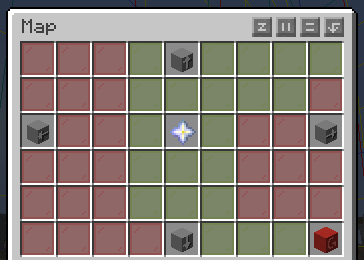
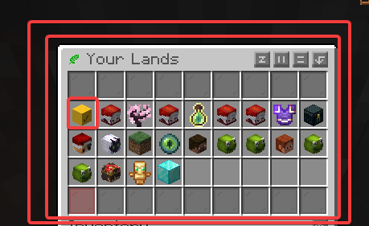
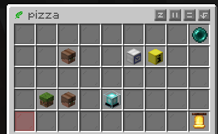
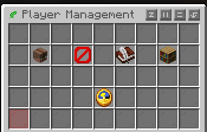
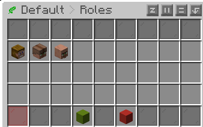
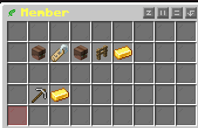
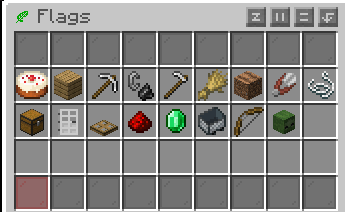
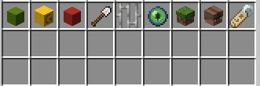
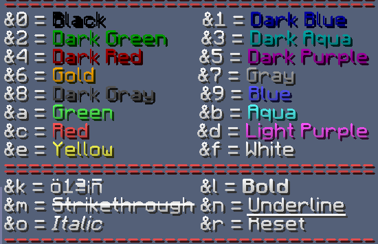

- [[#🏕️ Lands|🏕️ Lands]]
- [[#🚩- Basic lands - Creating a Lan|🚩- Basic lands - Creating a Lan]]
- [[#🚮Land removal due to inactivity|🚮Land removal due to inactivity]]
- [[#✅Trusted, ⛔ban and 🖇️merged lands|✅Trusted, ⛔ban and 🖇️merged lands]]
- [[#📋The menu and flags|📋The menu and flags]]
	- [[#📋The menu and flags#🛂 Player management|🛂 Player management]]
	- [[#📋The menu and flags#🛅 Roles|🛅 Roles]]
		- [[#🛅 Roles#⛏️Action Flags|⛏️Action Flags]]
		- [[#🛅 Roles#💼Management Flags|💼Management Flags]]
- [[#🍄 Miscellaneous|🍄 Miscellaneous]]
	- [[#🍄 Miscellaneous#💬 Land chat|💬 Land chat]]
	- [[#🍄 Miscellaneous#🌈 Change the land color and hide land entry message|🌈 Change the land color and hide land entry message]]
- [[#Bibliographic reference|Bibliographic reference]]

#  🏕️ Lands

The best way to start on the server is by creating a land, since griefing is allowed, it's the only way to protect yourself against it.

The land system protects 16x16 blocks, that is, 1 chunk. You can naturally view chunks by pressing f3 + G. From now on, we will use the word "land" to refer to the number of sites that can be claimed by the player. A player (without rank) can have up to 3 lands. This maximum of lands can be increased by purchasing a  [rank](https://purevanilla.co/shop/)
 
Each land can be used in all three dimensions (overworld, nether, and end). Therefore, optimize your lands well to get the best performance from them.

By default, you get 4 free chunks (including the initial one ). You can expand this with claimblock, which you get by [voting](https://purevanilla.co/vote) for the server Each land can claim an infinite number of chunks, it all depends on your "claimblock" availability.
# 🚩- Basic lands - Creating a Lan
**/lands maps**
It shows you a map of the area, where red is another player's land where you don't have trust. Yellow is where you do have trust. And green is your land. It's especially useful for getting started and deciding where you want to place your land. Remember you can't create lands or claim chunks . Remember, **you cannot create a land or make a claim if you are near another land.** This can be solved with flags, which the other player (if they wish) can grant you.

**/lands**
This menu displays your lands and those of other users where you have trust. It's important because you can execute almost all commands from within it. We'll delve deeper into this later.
![[lands_menu.png]]

| Command              | Description                                                                                                                                                                                                                                                                                                                                                                                                        |
| -------------------- | ------------------------------------------------------------------------------------------------------------------------------------------------------------------------------------------------------------------------------------------------------------------------------------------------------------------------------------------------------------------------------------------------------------------ |
| /lands create [name] | Create a new land Example: /lands create pizza                                                                                                                                                                                                                                                                                                                                                                     |
| /lands edit [name]   | You enter edit mode for your land. With that, you can execute the following commands                                                                                                                                                                                                                                                                                                                               |
| /lands rename [name] | Change the name of the current land                                                                                                                                                                                                                                                                                                                                                                                |
| /lands claim         | Claim more chunks in a land. By default, you get 4 free chunks (including the initial one ). You can expand this with claimblock, which you get by [voting](https://www.google.com/url?q=https://purevanilla.co/vote&sa=D&source=editors&ust=1780732289233125&usg=AOvVaw2g4Pt9TIAbBmpdklNPWlBz) for the server Each land can claim an infinite number of chunks, it all depends on your "claimblock" availability. |
| /lands unclaim       | You unclaim the chunk (it's that simple). If you spent ClaimBlock, you get a refund.                                                                                                                                                                                                                                                                                                                               |
| /lands delete [name] | You eliminate the land                                                                                                                                                                                                                                                                                                                                                                                             |
| /lands view          | You can see both your land and other players' lands; this behaves the same as the others. Green (your land), red (another player's land without trust), yellow (land with trust).                                                                                                                                                                                                                                  |
| /lands setspawn      | You set the spawn point of your land                                                                                                                                                                                                                                                                                                                                                                               |
| /lands spawn [name]  | You teleport to your own land or to other players' lands where you have trust.                                                                                                                                                                                                                                                                                                                                     |



# 🚮Land removal due to inactivity
To keep the map clean, there's a land removal system. This takes several years to take effect. Don't worry if you have 30 days (720 hours) of playtime; it would take about 2.5-3 years of inactivity for it to activate.
Furthermore, the land's ownership rotates among the members, thus preventing the land from being completely eliminated.
# ✅Trusted, ⛔ban and 🖇️merged lands

| Command                 | Description                                                                                              |
| ----------------------- | -------------------------------------------------------------------------------------------------------- |
| /lands trust [player]   | You give the player trust                                                                                |
| /lands untrust [player] | Did the player you trusted break down your door? Don't worry, you can remove the trust with this command |
| /lands ban [player]     | You ban the player from your land, so they can't enter your land.                                        |
| /lands merge [land]     | Merge two lands                                                                                          |

**Trusted,ban example**



**Merged land**



# 📋The menu and flags
As mentioned earlier, some commands can be executed directly from /lands. First, we select the land to edit, in this case "pizza".

**We will encounter the following menu:**

## 🛂 Player management

**Members:** Land members, you can directly add or remove players there
**Banned:** Well, banned players
**Membership Request:** In this section you can enable or disable automatic player joins to your land; this is ideal if you want to create a public land and want everyone to be able to teleport there
**Natural flags**
Important flags that will be disabled by default, **as enabling them would allow players to grief your land**. However, some nature flags are needed by technical/casual players for farming, etc.

| Flag                | Description                                  |
| ------------------- | -------------------------------------------- |
| Entity Griefing     | Mobs will be able to break into your land    |
| TNT Explosions      | Enabled TNT Explosions                       |
| Water and Lava Flow | Allow water or lava flow from the wilderness |
## 🛅 Roles
There are currently 4 roles

| Rol        | Description                                                                               |
| ---------- | ----------------------------------------------------------------------------------------- |
| Owner      | You                                                                                       |
| Members    | Trusted  player                                                                           |
| Untrusted  | Untrusted player                                                                          |
| Custom rol | You can customize this role however you like; you create it by clicking the green button. |

Clicking on one of them will take you to the following flags menu: In this case, we will edit the Members flag.

### ⛏️Action Flags

These are essentially the actions that the role can perform inside the land. The member role is fully active by default.
### 💼Management Flags
This section is crucial as it allows you to grant players permissions to claim land, build, destroy, and perform other actions. It is NOT recommended to modify these settings in an untrusted role

| Flag                        | Description                                                                                                                                                                                                                                                                                     |
| --------------------------- | ----------------------------------------------------------------------------------------------------------------------------------------------------------------------------------------------------------------------------------------------------------------------------------------------- |
| Trust players               | Trust players on land                                                                                                                                                                                                                                                                           |
| Set roles                   | Set roles on land                                                                                                                                                                                                                                                                               |
| Untrust players             | Untrust players on land                                                                                                                                                                                                                                                                         |
| Claim and unclaim           | It's always recommended to leave this flag disabled, unless you have a lot of trust in the members of your land.                                                                                                                                                                                |
| Claim Land at border        | This allows players to claim land near the edge of your land. By default, each land is separated by one chunk. Enabling this flag allows lands to be contiguous, which is ideal for creating towns between players, helping to avoid blind spots and reducing potential griefing opportunities. |
| Edit Natural Flags          | Edit Natural Flags on land                                                                                                                                                                                                                                                                      |
| Edit Role Settings          | Edit Role Setting on land                                                                                                                                                                                                                                                                       |
| Edit miscellaneous Settings | Edit miscellaneous Settings on land                                                                                                                                                                                                                                                             |
# 🍄 Miscellaneous
## 💬 Land chat

Want to make plans with members of your lands? There's an option to speak exclusively with members of your lands.

Simply use the following: @lands [message]. To write to a land, do @lands [land] [message]

https://www.youtube.com/watch?v=KpXDUGcfklg
## 🌈 Change the land color and hide land entry message
While directly in the land area, you can type the command  /lands rename [name] . Below is a list of colors you can use. Example /lands rename &d&l Cherry



If you're shy and want to hide the welcome to your land, you can do the following


# Bibliographic reference

Lands main page: [https://wiki.incredibleplugins.com/lands](https://wiki.incredibleplugins.com/lands)

Color codes: https://www.spigotmc.org/resources/colorcodes.32415/
