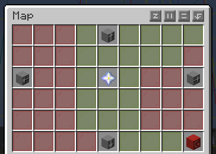
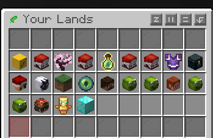
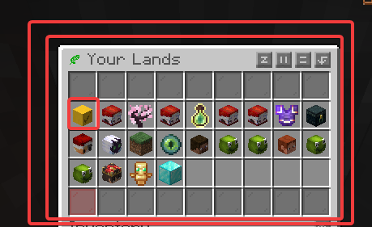
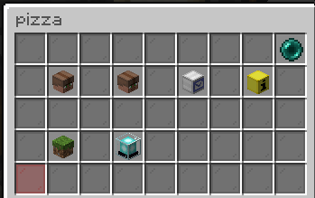
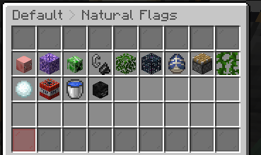
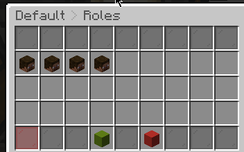
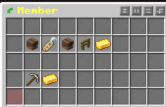
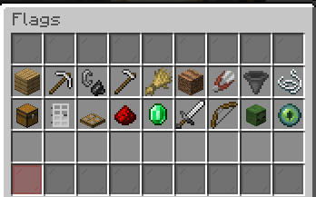
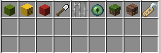

# Lands system

> A protection system to prevent grief.       
> This section explains how to use it. The available commands.

---
## Table of Contents

- [Lands system](#lands-system)
  - [Table of Contents](#table-of-contents)
  - [1. Lands Introduction](#1-lands-introduction)
  - [2. Basic lands - Creating a Land](#2-basic-lands---creating-a-land)
  - [3. Trusted and Merged Lands](#3-trusted-and-merged-lands)
  - [4. Menu and Flags](#4-menu-and-flags)
    - [4.1 Natural flags](#41-natural-flags)
    - [4.2 Roles](#42-roles)
    - [4.3 Action flag](#43-action-flag)
    - [4.4 Management Flags](#44-management-flags)
  - [5.  Miscellaneous](#5--miscellaneous)
    - [5.1 💬 Land chat](#51--land-chat)
    - [5.2 Change the land color and hide land entry message](#52-change-the-land-color-and-hide-land-entry-message)
  - [6. Q\&A About Lands](#6-qa-about-lands)
  - [7.  Bibliographic reference](#7--bibliographic-reference)

---
## 1. Lands Introduction
The best way to start on the server is by creating a land, griefing isn't allowed (except containers outside of claimed lands, please read the [rules](https://purevanilla.co/rules) of cool mode ),but this will save you from mishaps and let you know if you were griefed or not., it's the only way to protect yourself against it.

The land system protects 16x16 blocks(1 chunk). You can naturally view chunks by pressing f3 + G. From now on, we will use the word "land" to refer to the number of sites that can be claimed by the player. A player (without rank) can have 4 lands. 

Each land can be used in all three dimensions (overworld, nether, and end). Therefore, optimize your lands well to get the best performance from them.

By default, you get 12 free chunks (including the initial one ). You can expand up to 25 chunks, each expansion consumes gems (in-game currency)

This maximum of lands and chunks can be increased by purchasing a rank on the server (either with real money or with gems (which are obtained by voting for the server)) https://purevanilla.co/shop/
## 2. Basic lands - Creating a Land
Before diving into how to create it, we need to introduce some useful commands that will help you better position your land.

**/lands map**

It shows you a map of the area, where red is another player's land where you don't have trust. Yellow is where you do have trust. And green is your land. It's especially useful for getting started and deciding where you want to place your land.

**/lands**

 This menu displays your lands and those of other users where you have trust. It's important because you can execute almost all commands from within it. We'll delve deeper into this later.  

| Command              | Description                                                                                                                                                                                       |
| -------------------- | ------------------------------------------------------------------------------------------------------------------------------------------------------------------------------------------------- |
| /lands create [name] | Create a new land. Example: /lands create pizza                                                                                                                                                   |
| /lands edit [name]   | You enter edit mode for your land. With that, you can execute the following commands                                                                                                              |
| /lands rename [name] | Change the name of the current land                                                                                                                                                               |
| /lands claim         | Claim more chunks in a land. |
| /lands unclaim       | Unclaim the chunk.                                                                                                            |
| /lands delete [name] | Remove the land                                                                                                                                                                            |
| /lands view          | You can see both your land and other players' lands. Green (your land), red (another player's land without trust), yellow (land with trust).                                                      |
| /lands setspawn      | You set the spawn point of your land                                                                                                                                                              |
| /lands spawn [name]  | You teleport to your own land or to other players lands where you have trust.     
| /lands unstuck  | Teleport out of a land if you get stuck. 

An explanatory video about the commands shown above  



**/lands selection**

 Claim chunks in a different way (hoe), you're probably familiar with a plugin that uses a shovel



## 3. Trusted and Merged Lands
| Command                 | Description                                                                                               |
| ----------------------- | --------------------------------------------------------------------------------------------------------- |
| /lands trust [player]   | You give the player trust                                                                                 |
| /lands untrust [player] | Did the player you trusted break down your door? Don't worry, you can remove the trust with this command  |
| /lands merge [land]     | Merge two lands                                                                                           |

**Example of a /lands merge**


## 4. Menu and Flags
As mentioned earlier, some commands can be executed directly from /lands. First, we select the land to edit, in this case "pizza".

We will encounter the following menu:  

### 4.1 Natural flags

Important flags that will be disabled by default, as enabling them would allow players to grief your land. However, some nature flags are needed by technical/casual players for farming, etc.

### 4.2 Roles

There are currently 4 roles in the land: Owner, Member, Benefactor and untrusted  

Clicking on one of them will take you to the following flags menu: In this case, we will edit the Members flag.  

### 4.3 Action flag

These are essentially the actions that the role can perform inside the land. The member role is fully active by default.

### 4.4 Management Flags
> **Warning:** This section is crucial as it allows you to grant players permissions to claim land, build, destroy, and perform other actions. It is NOT recommended to modify these settings in an untrusted role.

| Flag                        | Description                                                                                                                                                                                                                                                                                     |
| --------------------------- | ----------------------------------------------------------------------------------------------------------------------------------------------------------------------------------------------------------------------------------------------------------------------------------------------- |
| Trust players               | Trust players on land                                                                                                                                                                                                                                                                           |
| Set roles                   | Set roles on land                                                                                                                                                                                                                                                                               |
| Untrust players             | Untrust players on land                                                                                                                                                                                                                                                                         |
| Claim and unclaim           | It's always recommended to leave this flag disabled, unless you have a lot of trust in the members of your land.                                                                                                                                                                                |
| Claim Land at border        | This allows players to claim land near the edge of your land. By default, each land is separated by one chunk. Enabling this flag allows lands to be contiguous, which is ideal for creating towns between players, helping to avoid blind spots and reducing potential griefing opportunities. |
| Edit Natural Flags          | Edit Natural Flags on land                                                                                                                                                                                                                                                                      |
| Edit Role Settings          | Edit Role Settings on land                                                                                                                                                                                                                                                                      |
| Edit miscellaneous Settings | Edit miscellaneous Settings on land    
## 5.  Miscellaneous

### 5.1 💬 Land chat

Want to make plans with members of your lands? There's an option to speak exclusively with members of your lands.

Simply use the following: `@lands [message]`. To write to a specific land, use `@lands [land] [message]`.



### 5.2 Change the land color and hide land entry message

While directly in the land area, you can type the command `/lands rename [name]`. Below is a list of colors you can use. Example: `/lands rename &d&l Cherry`



If you want to hide the welcome to your land, you can do the following:


## 6. Q&A About Lands
**1. My redstone components (like dispensers, pistons, etc.) self-destruct, and liquids aren't flowing either.**
- That is part of the lands system, designed to prevent griefing. It usually triggers when redstone or fluids are placed in an unclaimed chunk that is adjacent to a claimed land.

**2. I can't create my first land; it tells me I don't have permission for land [name].**

- You are probably using the wrong command; the correct command is /lands create [name]

**3. I used the Land barrel(storage by default), but then I deleted it, is it possible to get it back?**
  
- It depends on whether you have previously run the `/lands delete` command; if you did, unfortunately, it cannot be recovered. If not, please watch this video on how to put again the storage. *Note: If you previously used `lands unclaim` or `lands unclaim all`, please claim a chunk(with the same land); so will allow you to proceed. Do not confuse the `lands delete` command with `lands unclaim all and /lands unclaim`.*


**4. My totem farm isn't working on a land**
  
- Unfortunately, only the land owner can use the farm totem (due to flag settings), and this cannot be changed; if you want to use it, you will have to ask the owner to unclaim that land.

**5. I got stuck in a land and can't get out.**

 - Use the command ``/lands unstuck`` to leave the area. If it doesn't work, you can use /rtp.

## 7.  Bibliographic reference

Lands main page: [https://wiki.incredibleplugins.com/lands](https://wiki.incredibleplugins.com/lands)

Color codes: [https://www.spigotmc.org/resources/colorcodes.32415/](https://www.spigotmc.org/resources/colorcodes.32415/)