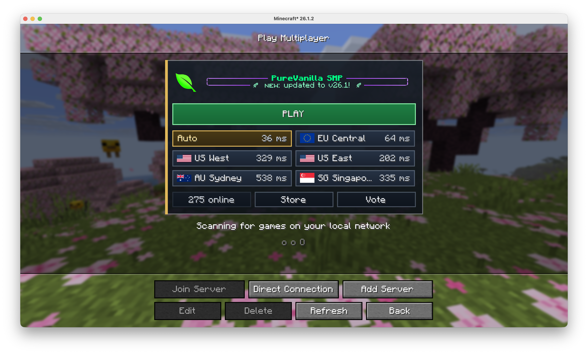
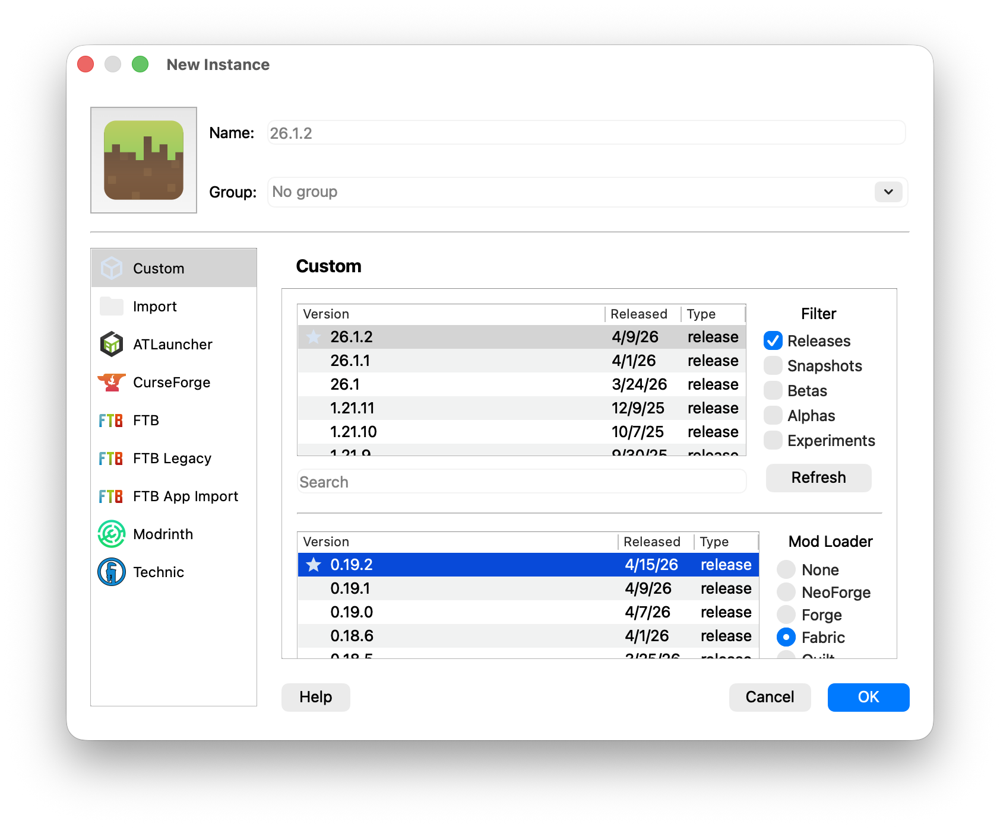
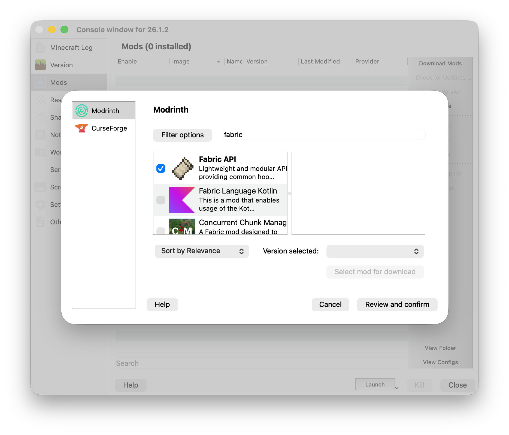
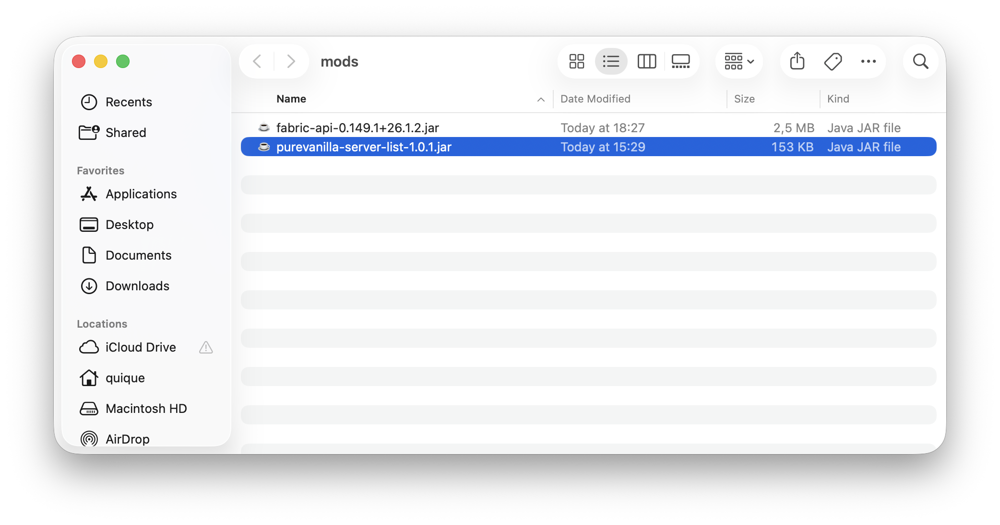

# PureVanilla Mod

The **PureVanilla mod** is a client-side Fabric mod that makes joining PureVanilla easier from Minecraft's multiplayer screen. Instead of manually adding server addresses, it adds a PureVanilla panel directly inside the multiplayer list where you can see the server message, check regional pings, and join through the fastest available route with a single **PLAY** button.

It requires **Fabric** for Minecraft **v26.1.2** or newer. It does not change gameplay or give any in-game advantage.

Download from Modrinth
Download from GitLab

<strong>FabricAPI required</strong> — make sure FabricAPI is installed alongside this mod.

---

<strong>Install manually from GitLab using Fabric</strong>

 

This method uses **Prism Launcher** to manage your instance and requires downloading the mod file manually.

### 1. Download Prism Launcher

Download and install [Prism Launcher](https://prismlauncher.org/download) for your operating system.

### 2. Create a new instance

Open Prism Launcher and click **Add Instance**.

In the instance creation dialog, select **Fabric** as the mod loader and choose **v26.1.2** as the version, then click **OK**.

### 3. Add FabricAPI

Right-click your new instance and select **Edit**.

Go to the **Mods** tab, then click **Download mods**. Search for **Fabric API**, select it, and click **Download**.

### 4. Install the PureVanilla mod

On the Mods screen, click **View Folder** to open the mods directory.

Download the latest PureVanilla mod `.jar` from [GitLab releases](https://gitlab.com/purevanilla/mods/purevanilla/-/releases) and drop it into that folder.

### 5. Launch and connect

Start the instance and connect. Open **Multiplayer** and use the PureVanilla panel at the top of the server list.

---

<strong>Install automatically from Modrinth</strong>

 

This method lets **Prism Launcher** or the **Modrinth App** handle everything, including downloading FabricAPI automatically.

### 1. Get a launcher

Download either:
- [Prism Launcher](https://prismlauncher.org/download)
- [Modrinth App](https://modrinth.com/app)

### 2. Find and install PureVanilla

Search for **PureVanilla** on [Modrinth](https://modrinth.com/mod/purevanilla) or directly within your launcher's mod browser. Select the mod and click **Install** (or **Download**).

The launcher will automatically install **FabricAPI** as a dependency if it isn't already present.

### 3. Launch and connect

Start the instance from your launcher, open **Multiplayer**, and use the PureVanilla panel at the top of the server list.

---

<strong>Install using the official Minecraft Launcher</strong>

 

The official launcher doesn't have a built-in mod browser, so the setup takes a few extra steps.

### 1. Create a Minecraft installation

Open the official Minecraft Launcher, go to **Installations**, and create a new installation using version **v26.1.2**. Launch it once so the game files are generated, then close the game.

### 2. Install Fabric

Download and run the [FabricMC installer](https://fabricmc.net/use/installer/). Select **v26.1.2** and click **Install**. This creates a new Fabric profile in the launcher.

### 3. Add the mods

Open the Minecraft mods folder. You can find it at:

- **Windows:** `%AppData%\.minecraft\mods`
- **macOS:** `~/Library/Application Support/minecraft/mods`
- **Linux:** `~/.minecraft/mods`

Download and drop both files into that folder:

1. **FabricAPI** — from [Modrinth](https://modrinth.com/mod/fabric-api)
2. **PureVanilla mod** — from [GitLab releases](https://gitlab.com/purevanilla/mods/purevanilla/-/releases) or [Modrinth](https://modrinth.com/mod/purevanilla)

### 4. Launch with the Fabric profile

In the Minecraft Launcher, select the **Fabric** profile and click **Play**. The mods will load automatically.

{}
If you already have mods installed for a different Minecraft version, make sure the mods folder corresponds to the correct version profile, or consider using Prism Launcher to keep instances isolated.
{}

