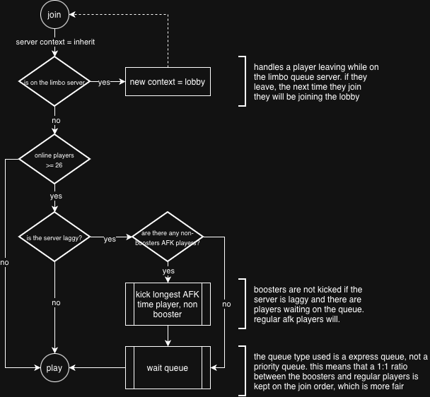

# Queue

Our **queue system** isn't designed to be a money grab—it's here to ensure **gameplay quality**. There's simply no way to guarantee smooth server performance with unlimited online players, so we limit how many can play at once.

That said, we know how annoying queues can be. We hate them too. That's why we developed our **custom queue engine** in-house, with features that set it apart from typical systems.

## When Does the Queue Activate?

The queue **only kicks in** when:

1. The server you're trying to join is **experiencing lag**
2. There are **more than 25 players** online

If the server is running smoothly, you'll never even see the queue in action.

## AFK Kick System

When you join the queue, we'll attempt to **kick the player who has been AFK the longest** on the server. This helps ensure active players get priority access.

{}
**Boosters are exempt** from AFK kicks. If you want to ensure you're never kicked while AFK, consider becoming a **Booster**!
{}

## What Happens If You Get Kicked?

If you're kicked for being AFK (which, again, only happens when there are people waiting in queue and you're not a Booster), you'll simply **join the queue** to get back in.

{}
**Anti-Abuse Protection**: If you were kicked for being AFK, rejoining won't cause another AFK player to be kicked for **20 minutes**. This prevents abuse of the system.
{}

## Express Queue (Not Priority Queue)

Our queue uses an **express system**, not a priority system. What's the difference?

| Type | How It Works |
|------|--------------|
| **Priority Queue** | Boosters always go first, regular players wait indefinitely |
| **Express Queue** ✓ | Maintains a stable ratio of Boosters and regular players joining |

This ensures a **fair balance** where both Boosters and regular players can join in a reasonable manner—no one gets left behind forever.
