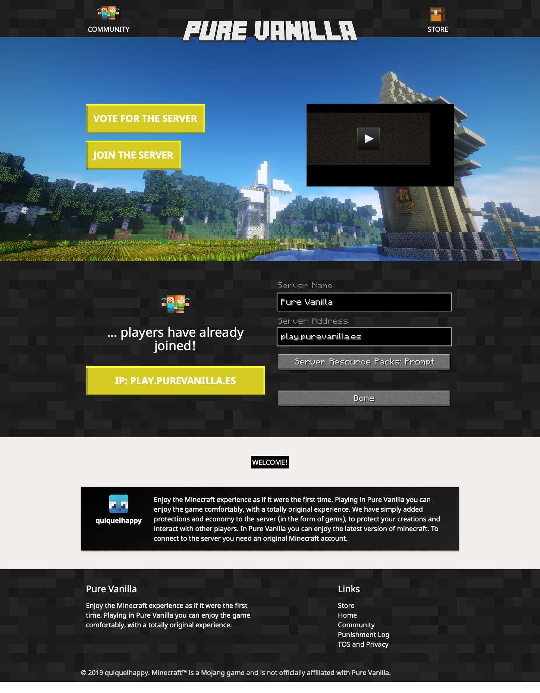
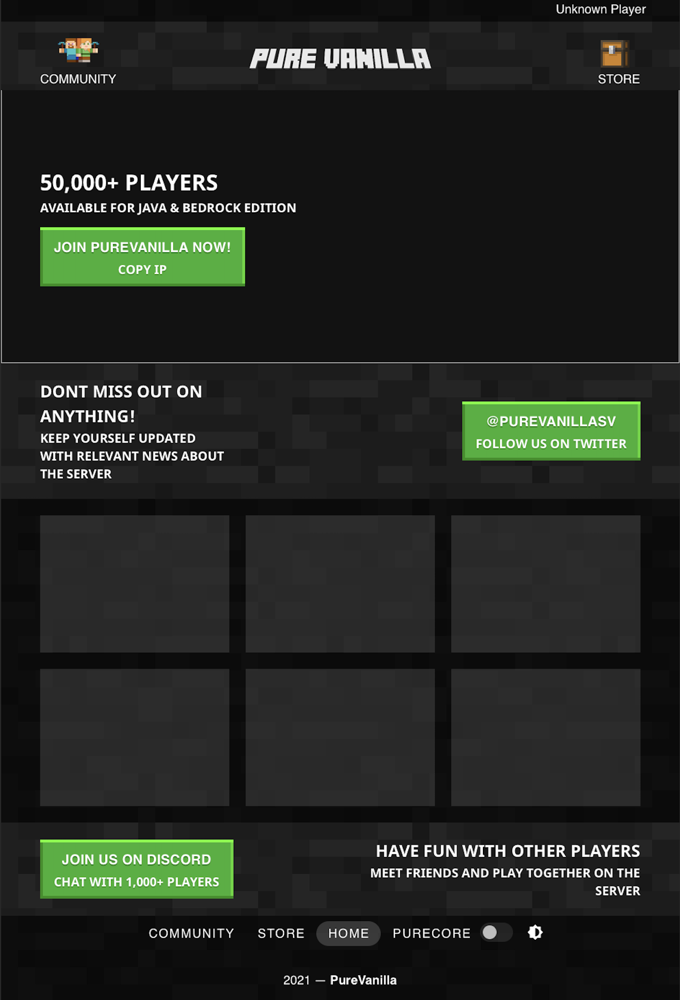
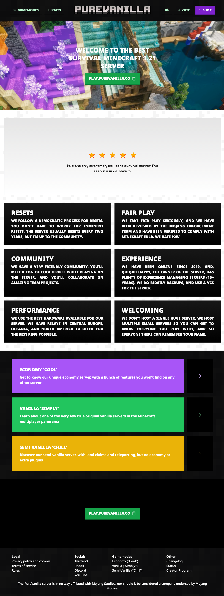

# Website
Our website provider useful tools for the server, mainly the server store and the voting page.

# History
## 2019
Our first ever version of the website was coded using bare HTML, JS and CSS, using Materialize components. The website primary color was yellow, which was quickly changed to green months after first releasing the first version of the server. By this point, the server didn't really have a logo, and a resource pack (of which we don't really remember the name of) logo was used. At some point around summer 2019, a logo designing contest was organized to design the new logo for PureVanilla. The contest was fairly unpopular and only a few people decided to participate. We had planned to give out monetary compensation to the winner, but due to the lack of competition, we decided there were no real 'winners', hence why we decided to scrub the monetary reward. The logo was designed by [One Command Kristopher](https://www.youtube.com/@onecommandkristopher3000)
{}

{}

## 2020
The website switched to VueJS instead of plain HTML. The same stylesheet was used, but with help of Vuetify components.

{}

{}

## 2023
The website switched to SvelteJS from VueJS of plain HTML. The stylesheet was completely re-done, using original components with no other component framework.

{}

{}
